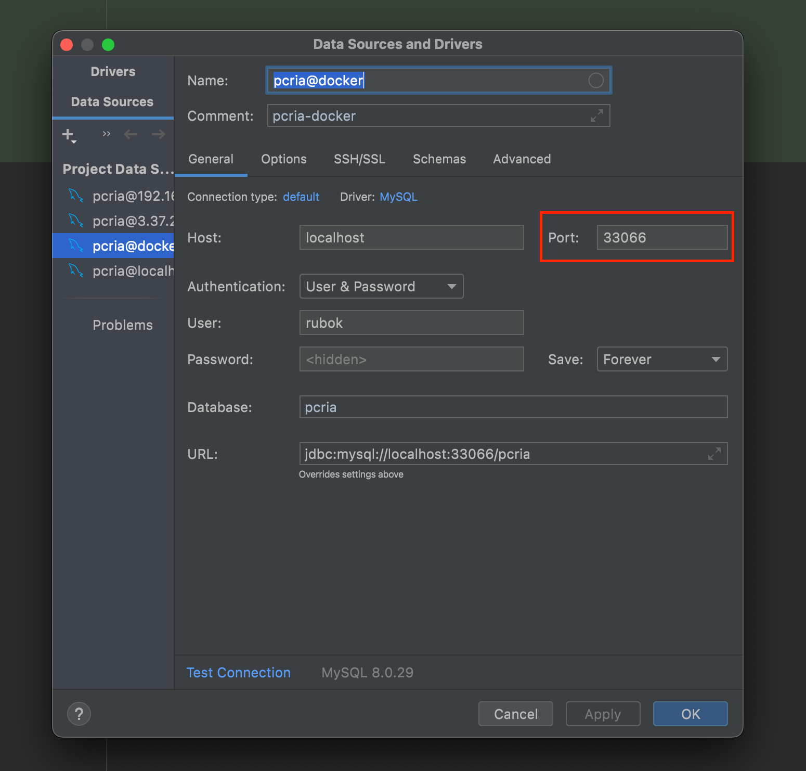
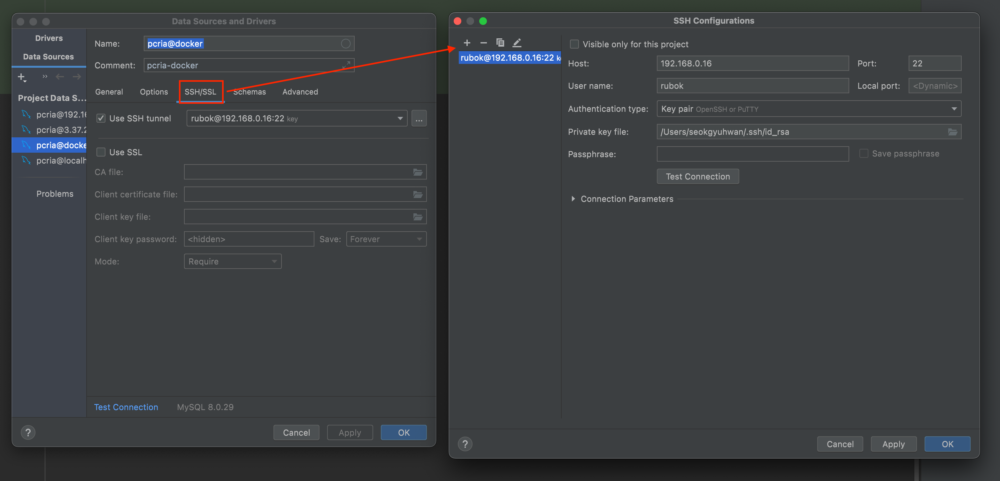

# spring-pcria-project-v2
pcria 레거시 개선 프로젝트

# 개선 사항

1. css (예전 커밋 정보에서 가져오)
2. file upload (관련 포스팅 : [링크](https://takeknowledge.tistory.com/61))
   - DB 에서 파일 이름 가져온 뒤 경로 찾기
3. 짜파게티 이미지 경로 (농심 공식 홈페이지에서 가져옴)
4. 프로필 유저 정보 - 사용시간 컬럼 오류로 인한 load 실패(컬럼형식 int -> date)
5. 모바일 환경에서 로그인 페이지에 있는 background image 나오지 않고 가운데 정렬로 이루어 지도록 변경

# 현재 문제점

1. LoginCheckInterceptor 기능 - 사용 X
2. 프로필 사진 변경 후 새로 빌드하지 않으면 이미지 변경되지 않음

# 배포

- Heroku

## Heroku 설치 가이드

### 회원가입

> https://www.heroku.com/

### Procfile

프로젝트 root 경로에 확장자 없이 Procfile 생성.

web: java -Dserver.port=$PORT -Dspring.profiles.active=dev -jar build/libs/pcria-0.0.1-SNAPSHOT.jar

Heroku는 빌드할 때 마다 port 번호가 변하기 때문에 heroku port를 변수로 받아 실행할 수 있도록 명령어를 작성해준다.

### Heroku CLI

```shell
# heroku 설치
$ brew install heroku/brew/heroku

# heroku login
$ heroku login

# 원격 등록
$ heroku git:remote -a pcria

# heroku 저장소에 push
$ git push heroku master

# heroku 클라이언트 설정
$ heroku ps:scale web=1

# 접속 확인
$ heroku open

# log 확인
$ heroku logs --tail
```

### Heroku url

https://pcria.herokuapp.com/

### Heroku 의 문제

Heroku 는 30분 내에 트래픽이 발생하지 않으면 sleep 모드로 들어가 재접속시 긴 시간이 필요함.

#### 해결

1. 매 30분 핑 발사 [링크](http://kaffeine.herokuapp.com)
2. linux 서버 crontab & curl 

[crontab 사용법](https://jdm.kr/blog/2)
[crontab 설정](https://m.blog.naver.com/writer0713/221507833658)

# 도커

## Dockerfile 생성

- Spring boot & JSP 를 사용할 수 있는 이미지로 작성

## docker-compose.yml 생성

> mysql & pcria 를 도커 컨테이너로 띄운 뒤 연동 성공 <br>
> mysql 정보를 로컬과 동기화 시키는 작업 성공


# 홈서버

## 도커

> docker run --name pcria -p 30001:8080 -d --add-host=host.docker.internal:host-gateway -e USE_PROFILE=local --restart unless-stopped menofdocker/pcria
> docker run --name mysql -e MYSQL_ROOT_PASSWORD=root -d -p 33066:3306 -v /mnt/storage1/db-data/mysql:/var/lib/mysql --add-host=host.docker.internal:host-gateway --restart unless-stopped menofdocker/mysql

### docker 의 mysql

- 접근방법

- docker 실행시 작성했던 port 번호를 입력한다.

- SSH/SSL 에서 본인의 키를 넣어 홈서버로 접근한다.